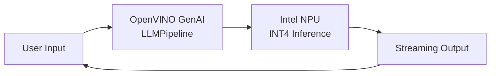

<div align="center">

# Mistral-for-NPU

### Run LLMs Locally on Your Intel NPU — No GPU Needed

Harness the power of Intel's Neural Processing Unit to run large language models **privately, offline, and efficiently** on your laptop. Zero cloud dependency. Zero GPU required.

[](LICENSE)
[](https://www.python.org/)
[](https://github.com/openvinotoolkit/openvino)
[](https://github.com/zirenjin/Mistral-for-NPU/stargazers)
[](https://github.com/zirenjin/Mistral-for-NPU/issues)

<!-- TODO: Add terminal demo GIF here -->
<!-- Record with asciinema or ScreenToGif showing: model loading → user asks a question → streaming response on NPU -->
<!-- Recommended size: 800x450, format: GIF or MP4, length: 15-30 seconds -->

</div>

---

## Why Mistral-for-NPU?

Most local LLM solutions require a beefy GPU or suffer from painfully slow CPU inference. **Mistral-for-NPU** takes a different path — it runs large language models on Intel's dedicated Neural Processing Unit (NPU), a specialized AI accelerator built right into modern Intel Core Ultra processors.

- **NPU-Accelerated Inference** — Offload LLM workloads to Intel AI Boost (up to 47 TOPS), leaving your CPU and GPU free for other tasks
- **Fully Offline & Private** — Your data never leaves your machine. No cloud API keys, no internet required, no telemetry
- **5-Minute Setup** — Clone, install, download a model, and chat. ~240 lines of Python, no complex build steps
- **Multi-Model Support** — Run Mistral-7B, DeepSeek-R1, Qwen3-8B, or Phi-3-mini with a single command switch
- **Cross-Platform** — Works on Windows 11 and Linux with one-click launcher scripts

> **If you find this project useful, please consider giving it a star** — it helps others discover NPU-powered local AI.

---

## Performance Benchmarks

<!-- TODO: Fill in all TBD values with actual benchmark data -->
<!-- Run each model 3 times and take the average. Use a standard prompt like "Explain quantum computing in simple terms" -->

### NPU Inference Performance

| Model | Parameters | Quantization | Tokens/s (NPU) | First Token Latency | Memory Usage |
|-------|-----------|-------------|----------------|---------------------|-------------|
| Mistral-7B | 7B | INT4 | TBD | TBD | TBD |
| DeepSeek-R1-1.5B | 1.5B | INT4 | TBD | TBD | TBD |
| DeepSeek-R1-7B | 7B | INT4 | TBD | TBD | TBD |
| Qwen3-8B | 8B | INT4 | TBD | TBD | TBD |
| Phi-3-mini | 3.8B | INT4 | TBD | TBD | TBD |

### NPU vs CPU vs GPU (Mistral-7B INT4)

| Device | Tokens/s | First Token Latency | Power Consumption |
|--------|---------|---------------------|-------------------|
| NPU (Intel Core Ultra) | TBD | TBD | TBD |
| CPU (same processor) | TBD | TBD | TBD |
| GPU (Intel Arc iGPU) | TBD | TBD | TBD |

<!-- TODO: Add test environment details -->
<!-- Format: Processor model, RAM, OS version, OpenVINO version, NPU driver version -->

<details>
<summary><b>Test Environment</b></summary>

- **Processor**: TBD <!-- e.g., Intel Core Ultra 7 155H -->
- **Memory**: TBD <!-- e.g., 32GB LPDDR5x-7467 -->
- **OS**: TBD <!-- e.g., Windows 11 24H2 -->
- **OpenVINO**: TBD <!-- e.g., 2025.1.0 -->
- **NPU Driver**: TBD <!-- e.g., 32.0.100.3104 -->

</details>

> **Why NPU matters for local LLM**: The NPU is purpose-built for AI workloads with exceptional power efficiency. While a CPU might drain your laptop battery in 2 hours running inference, the NPU can sustain the same workload for significantly longer — making it ideal for on-device AI during extended sessions, meetings, or travel.

---

## How It Works



| Component | Detail |
|-----------|--------|
| **Model Format** | OpenVINO IR with INT4 channel-wise (CW) quantization |
| **Inference Engine** | OpenVINO GenAI `LLMPipeline` — handles tokenization, generation, and decoding in one call |
| **Hardware Target** | Intel AI Boost NPU — dedicated neural accelerator on Intel Core Ultra |
| **Key Features** | Token streaming, multi-turn conversation history, automatic context overflow management |

The entire inference pipeline is ~240 lines of Python. No C++ compilation, no CUDA setup, no complex dependencies.

---

## Supported Hardware

### Tested Processors

| Processor Series | NPU Generation | AI Performance | Status |
|-----------------|---------------|---------------|--------|
| Intel Core Ultra 100 (Meteor Lake) | NPU 3720 | 11 TOPS | Tested |
| Intel Core Ultra 200V (Lunar Lake) | NPU 4 | 48 TOPS | Tested |
| Intel Core Ultra 200S (Arrow Lake) | NPU 3720 | 11 TOPS | Should work |

> Any Intel processor with a built-in NPU should theoretically work. If you test on a processor not listed above, please [open an issue](https://github.com/zirenjin/Mistral-for-NPU/issues) to share your results!

<details>
<summary><b>How to Check if Your PC Has an NPU</b></summary>

**Windows:**
1. Open **Device Manager** (Win + X → Device Manager)
2. Look for **"Neural processors"** or **"Intel(R) AI Boost"**
3. If present, your processor has an NPU

**Linux:**
```bash
lspci | grep -i "ai boost\|npu"
# or check for the Intel NPU device
ls /dev/accel*
```

**Quick check with Python:**
```python
import openvino as ov
core = ov.Core()
print(core.available_devices)  # Should include 'NPU'
```

</details>

---

## Who Is This For?

| User Profile | Use Case |
|-------------|----------|
| **Privacy-conscious users** | Run AI completely offline — no data leaves your machine |
| **Intel laptop owners** | Finally put that NPU to work with a real AI application |
| **Developers** | Prototype and test LLM integrations without GPU or API costs |
| **Students & researchers** | Free, local AI for learning and experimentation |
| **Enterprise users** | On-device AI for sensitive data that can't go to the cloud |

---

## Quick Start

### 1. Clone the Repository

```bash
git clone https://github.com/zirenjin/Mistral-for-NPU.git
cd Mistral-for-NPU
```

### 2. Install Dependencies

```bash
pip install -r requirements.txt
```

<!-- TODO: Add expected output screenshot showing successful installation -->

> **Note**: Requires Python 3.10+. If you have multiple Python versions, use `python3` or `py -3.10` instead.

### 3. Configure Environment

```bash
# Windows
copy .env.example .env

# Linux/macOS
cp .env.example .env
```

Edit `.env` if needed — the defaults work out of the box for Mistral-7B on NPU.

### 4. Download a Model

```bash
# See all available models
python src/download.py --list

# Download Mistral-7B (recommended, ~4GB)
python src/download.py mistral-7b
```

<details>
<summary><b>Slow download? (China mainland users)</b></summary>

Set the HuggingFace mirror before downloading:

```bash
# Windows
set HF_ENDPOINT=https://hf-mirror.com

# Linux/macOS
export HF_ENDPOINT=https://hf-mirror.com
```

Then run the download command again. Alternatively, use `huggingface-cli` with `--resume-download` for large models.

</details>

### 5. Start Chatting

```bash
# Windows
run_chat.bat

# Linux/macOS
chmod +x run_chat.sh && ./run_chat.sh

# Or directly
python src/chat.py
```

### Verify It's Working

After launching, you should see:

```
========================================
  NPU Chat
  Model: mistral_npu_cw
  Device: NPU
========================================

You >
```

<!-- TODO: Add actual terminal screenshot here -->

Type a message and verify you get a streaming response. If `Device: NPU` is shown, the NPU is active.

---

## Supported Models

| Model | Size | Best For | Download Command | HuggingFace |
|-------|------|----------|-----------------|-------------|
| **Mistral-7B** | ~4GB | General-purpose chat, coding, reasoning. **Recommended** | `python src/download.py mistral-7b` | [Link](https://huggingface.co/OpenVINO/Mistral-7B-Instruct-v0.3-int4-cw-ov) |
| DeepSeek-R1-1.5B | ~1GB | Lightweight reasoning, low-memory devices | `python src/download.py deepseek-1.5b` | [Link](https://huggingface.co/OpenVINO/DeepSeek-R1-Distill-Qwen-1.5B-int4-cw-ov) |
| DeepSeek-R1-7B | ~4GB | Advanced chain-of-thought reasoning | `python src/download.py deepseek-7b` | [Link](https://huggingface.co/OpenVINO/DeepSeek-R1-Distill-Qwen-7B-int4-cw-ov) |
| Qwen3-8B | ~5GB | Multilingual, strong Chinese language support | `python src/download.py qwen3-8b` | [Link](https://huggingface.co/OpenVINO/Qwen3-8B-int4-cw-ov) |
| Phi-3-mini | ~2GB | Compact yet capable, fastest inference | `python src/download.py phi3-mini` | [Link](https://huggingface.co/OpenVINO/Phi-3-mini-4k-instruct-int4-cw-ov) |

> **Switching models**: Change `MODEL_NAME` in your `.env` file to the downloaded model's folder name, then restart the chat.

---

## Configuration

All settings are managed via the `.env` file:

| Variable | Default | Description |
|----------|---------|-------------|
| `HF_TOKEN` | *(empty)* | HuggingFace token (optional for public models) |
| `MODEL_NAME` | `mistral_npu_cw` | Model folder name in `models/` |
| `DEVICE` | `NPU` | Inference device: `NPU`, `GPU`, or `CPU` |
| `MAX_PROMPT_LEN` | `4096` | Maximum context window length |
| `MAX_NEW_TOKENS` | `2048` | Maximum tokens per response |
| `TEMPERATURE` | `0.7` | Creativity level (0.0 = deterministic, 1.0 = creative) |
| `SYSTEM_PROMPT` | *(see .env)* | System instruction for the AI assistant |

### Preset Configurations

<details>
<summary><b>Low Memory Mode</b> — For 8GB RAM laptops</summary>

```env
MODEL_NAME=deepseek_r1_1.5b_npu_cw
MAX_PROMPT_LEN=2048
MAX_NEW_TOKENS=512
```
</details>

<details>
<summary><b>High Quality Mode</b> — Longer, more detailed responses</summary>

```env
MODEL_NAME=mistral_npu_cw
MAX_PROMPT_LEN=4096
MAX_NEW_TOKENS=4096
TEMPERATURE=0.5
```
</details>

<details>
<summary><b>Fast Response Mode</b> — Quick, concise answers</summary>

```env
MODEL_NAME=phi3_mini_npu_cw
MAX_PROMPT_LEN=2048
MAX_NEW_TOKENS=256
TEMPERATURE=0.3
```
</details>

<details>
<summary><b>System Prompt Examples</b></summary>

**Coding assistant:**
```env
SYSTEM_PROMPT=You are a senior software engineer. Provide concise, production-ready code with brief explanations. Use best practices and modern patterns.
```

**Writing assistant:**
```env
SYSTEM_PROMPT=You are a professional writing assistant. Help users improve clarity, grammar, and style. Be concise in suggestions.
```

**Multilingual assistant:**
```env
SYSTEM_PROMPT=You are a helpful assistant. Always answer in the same language as the user's question. Do not translate your response unless explicitly asked.
```

</details>

### Chat Commands

| Command | Description |
|---------|-------------|
| `/exit` | Exit the chat |
| `/clear` | Clear the screen |
| `/reset` | Reset conversation history |

---

## Comparison with Other Solutions

| Feature | **This Project (NPU)** | llama.cpp (CPU) | Ollama (GPU) | Cloud API |
|---------|:---------------------:|:---------------:|:------------:|:---------:|
| Hardware Required | Intel Core Ultra | Any CPU | NVIDIA GPU | Internet |
| Privacy | Full local | Full local | Full local | Data sent to cloud |
| Setup Difficulty | Easy | Medium | Easy | Easy |
| Power Efficiency | **Excellent** | Poor | Medium | N/A |
| Inference Speed | Medium | Slow | Fast | Fast |
| Cost | Free | Free | Free | Pay per token |
| Offline Support | Yes | Yes | Yes | No |
| Battery Friendly | **Yes** | No | No | N/A |

**When to choose this project over alternatives:**
- You have an Intel Core Ultra laptop and want to use its NPU
- Battery life matters — the NPU is far more power-efficient than CPU or GPU inference
- You want a dead-simple setup without compiling C++ (llama.cpp) or managing containers (Ollama)
- Privacy is non-negotiable and you need fully on-device, offline AI

---

## FAQ

<details>
<summary><b>Does my computer support this?</b></summary>

You need an Intel Core Ultra processor (Meteor Lake or newer) with a built-in NPU. Check Device Manager on Windows for "Neural processors" or "Intel(R) AI Boost". Most Intel Core Ultra laptops released from late 2023 onward have an NPU. See [Supported Hardware](#supported-hardware) for details.

</details>

<details>
<summary><b>How much faster is NPU compared to CPU?</b></summary>

<!-- TODO: Fill in actual speedup numbers after benchmarking -->
On the same Intel Core Ultra processor, the NPU typically delivers TBD faster inference than the CPU while consuming significantly less power. The real advantage is power efficiency — the NPU can run for hours on battery where CPU inference would drain it quickly.

</details>

<details>
<summary><b>Can I run larger models (13B, 70B)?</b></summary>

Currently, NPU inference is limited by the NPU's memory capacity. Models up to ~8B parameters (INT4 quantized) work well. Larger models like 13B or 70B are not feasible on current NPU hardware. For those, consider GPU-based solutions like Ollama or vLLM.

</details>

<details>
<summary><b>Does this work on AMD or Apple Silicon?</b></summary>

No. This project specifically targets Intel NPU via OpenVINO. For AMD, consider ROCm-based solutions. For Apple Silicon, consider MLX or llama.cpp with Metal acceleration.

</details>

<details>
<summary><b>How do I update to the latest model version?</b></summary>

Simply re-run the download command. It will download the latest version from HuggingFace:

```bash
python src/download.py mistral-7b
```

</details>

<details>
<summary><b>Model download is very slow (China mainland)</b></summary>

Set the HuggingFace mirror endpoint before downloading:

```bash
# Windows
set HF_ENDPOINT=https://hf-mirror.com

# Linux
export HF_ENDPOINT=https://hf-mirror.com
```

Then run the download command again.

</details>

<details>
<summary><b>Model fails to load on NPU</b></summary>

1. Ensure you have the latest Intel NPU driver installed
2. Try fallback devices by editing `.env`:
   ```env
   DEVICE=GPU  # or CPU
   ```
3. Make sure the model was downloaded completely (re-download if in doubt)

</details>

<details>
<summary><b>Chat crashes with "context too long" error</b></summary>

The chat automatically resets conversation history when the context limit is exceeded. You can also manually reset anytime:
```
You > /reset
```
Or reduce `MAX_PROMPT_LEN` in `.env` if it happens frequently.

</details>

---

## Roadmap

- [ ] Web UI interface (Gradio / Streamlit)
- [ ] API server mode (OpenAI-compatible endpoint)
- [ ] More model support (Llama, Gemma)
- [ ] Performance optimization and benchmarking suite
- [ ] Docker support
- [ ] Multi-language documentation (Chinese, Japanese, Korean)
- [ ] RAG (Retrieval-Augmented Generation) support
- [ ] Conversation export and history management

---

## Contributing

Contributions are welcome! Here's how you can help:

- **Report bugs** — [Open an issue](https://github.com/zirenjin/Mistral-for-NPU/issues) with your hardware info and error details
- **Share benchmark data** — Test on your processor and submit results via issue or PR
- **Add model support** — Add new OpenVINO-optimized models to the registry
- **Improve documentation** — Fix typos, add translations, improve clarity

```bash
# Fork, clone, create a branch, make changes, then submit a PR
git checkout -b feature/your-feature
```

---

## Project Structure

```
Mistral-for-NPU/
├── src/
│   ├── chat.py            # Main chat application (~140 lines)
│   └── download.py        # Model downloader utility (~100 lines)
├── models/                # Downloaded models (git-ignored)
├── run_chat.bat           # Windows one-click launcher
├── run_chat.sh            # Linux/macOS launcher
├── requirements.txt       # Python dependencies
├── .env.example           # Configuration template
├── .env                   # Your local config (git-ignored)
└── README.md
```

---

<!-- TODO: Add Star History chart once the repo has some traction -->
<!-- Uncomment when ready:
## Star History

[](https://star-history.com/#zirenjin/Mistral-for-NPU&Date)
-->

## Acknowledgements

- [OpenVINO](https://github.com/openvinotoolkit/openvino) — Intel's open-source AI inference toolkit
- [OpenVINO GenAI](https://github.com/openvinotoolkit/openvino.genai) — GenAI extension for streamlined LLM inference
- [HuggingFace](https://huggingface.co/OpenVINO) — Model hosting and community
- [Intel NPU Acceleration Library](https://github.com/intel/intel-npu-acceleration-library) — NPU software stack

## License

This project is licensed under the [MIT License](LICENSE).

---

<div align="center">

**Built with Intel NPU + OpenVINO** | On-device AI for everyone

If this project helped you, consider [giving it a star](https://github.com/zirenjin/Mistral-for-NPU) — it means a lot!

</div>
